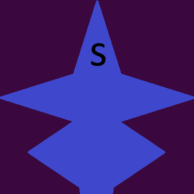
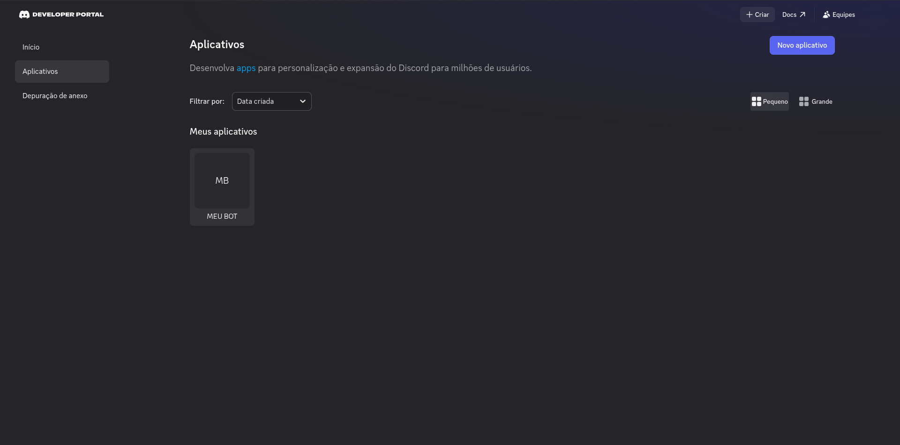
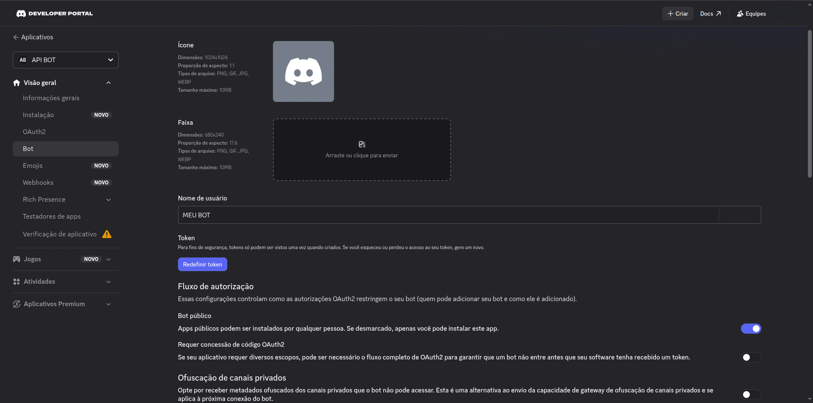
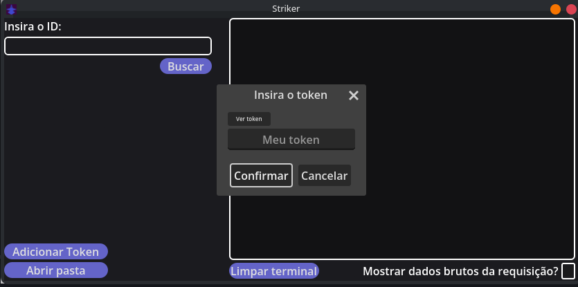
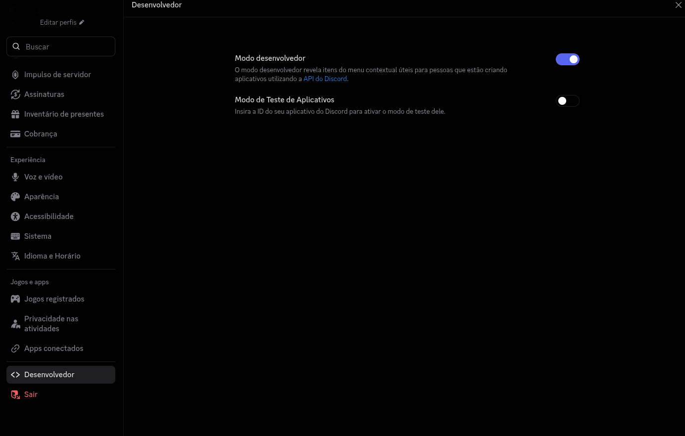
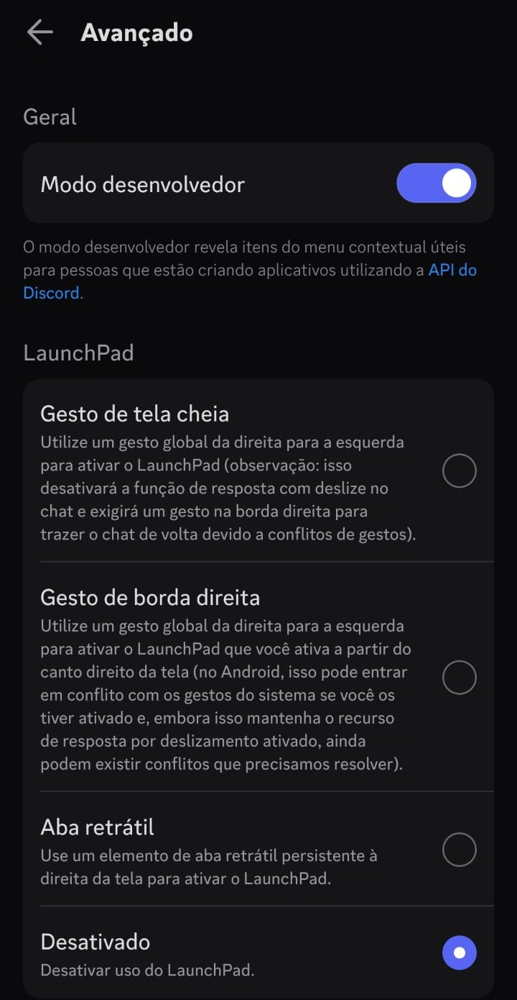
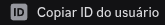
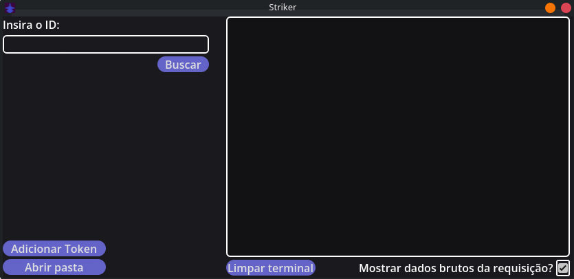

# Striker

Um aplicativo que obtém links de banners e avatares do Discord.

# Pontos importantes!
- O aplicativo ainda não foi finalizado, mas está com o desenvolvimento ativo. Portanto alguns bugs podem ser encontrados.
- O app está passando por uma refatoração pesada e pode sofrer severas mudanças em sua estrutura.

# LEGAL!

- Muito cuidado ao acessar o avatar/banner de alguém, não recomendamos o fazer sem o consentimento dessa pessoa.
- O Striker usa apenas rotas públicas da API e recursos oficiais oferecidos para desenvolvedores.
- O Striker tem o objetivo de ser um app de uso pessoal, portanto não apoia atitudes que visam o abuso do serviços do Discord.
-  **O Striker de NENHUMA forma está ligado a Discord Inc, e NÃO é endossado por tal!**

# Como usar?

#### Primeiro você precisa obter um token do discord.

- Você pode obter um em:
    https://discord.com/developers/applications/

- Faça login com sua conta e clique em "Novo aplicativo".
- Após criar um bot, clique nele vá na aba 'BOT'.
- Lá você poderá gerar um novo token, clicando em "Redefinir Token"

#### Adicione-o ao Striker
- Clique em "Adicionar Token", no popup que abrir, insira-o e clique em 'Confirmar'.

#### **Atenção, cuide do seu token!** ⚠️
- Nunca use o token da sua própria conta.
- Nunca compartilhe o token gerado no portal do Discord com ninguém.
- Não use o token de um bot seu já em uso, crie um somente para o Striker.
- O Striker não coleta e nem compartilha seu token, ele é armazenado exclusivamente no seu computador.

#### Após isso, você precisa ativar o modo de desenvolvedor no app do discord para a coleta dos IDs.

- Você pode fazer isso seguindo os passos para cada versão do Discord:

    - Desktop: Configurações -> Desenvolvedor -> Modo Desenvolvedor ✅

    

    - Mobile: Configurações -> Avançado -> Modo Desenvolvedor ✅
    
    
    
- Você pode copiar o ID de um usuário seguindo os passos para cada versão do Discord:

    - Desktop: Clique no mini perfil do usuário em questão com o botão direito do mouse e clique em 'Copiar ID do usuário'

    - Mobile: Abra o perfil do usuário em questão vá aos 3 pontos no canto e clique em 'Copiar ID do usuário"

    

#### Pronto!
- Com o token configurado você pode obter e abrir o link dos avatares e banners no navegador, clicando com o botão esquerdo do mouse em cima do link no console após a busca. 
- Basta adicionar o ID no campo "Isira o ID" e clicar em "Buscar".

#

# O Striker de NENHUMA forma está ligado a Discord Inc, e NÃO é endossado por tal!
